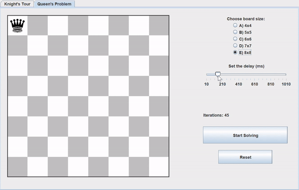

# Algorithm Visualizer: Knight's Tour and N-Queens Problem

An interactive and educational tool for visualizing classic algorithmic problems in computer science.

## 🎯 Motivation

Visualizing algorithms can make complex problems more understandable and engaging. This project aims to help users grasp the intricacies of classic algorithmic challenges through interactive visualizations.

## 📊 Visualizations

- **Knight's Tour Visualization**: Watch the knight traverse the chessboard, visiting each square exactly once.
  - Algorithms: Warnsdorf's Rule and Backtracking
  - Speed control for step-by-step analysis
  - Reset Button
    

  

- **N-Queens Problem Solver**: Visualize the placement of N queens on an NxN chessboard without threats.
  - Adjustable board size (4 - 8)
  - Speed control
  - Iterations counter

  

## 🌟 Features

- **User-Friendly Interface**: Intuitive controls and real-time visualization.
- **Educational Tooltips**: Learn about each algorithm as you watch it in action.
- **Performance Metrics**: Track solving time and number of steps for each algorithm.

## 🛠️ Technologies Used

- Java
- Swing GUI toolkit

## 🚀 Getting Started

1. Clone the repository:
`git clone https://github.com/lorenzozamel/algorithm-visualizer.git`
2. Open the project in your favorite Java IDE.
3. Run the `Main.java` file to start the application.

## 📞 Contact

Lorenzo Zamel - [lorenzozamel@gmail.com](mailto:lorenzozamel@gmail.com)

Project Link: [https://github.com/lorenzozamel/algorithm-visualizer](https://github.com/lorenzozamel/algorithm-visualizer)

---

   
